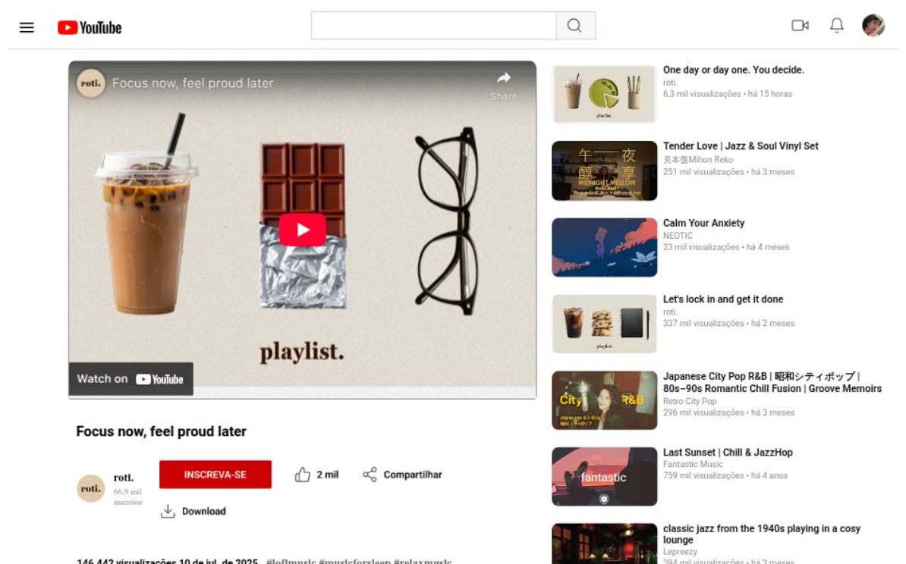

# CSS Track - Challenge 02: YouTube Page

Reproduction of a **YouTube** page focusing on **CSS and Flexbox**, developed as part of the **Santander 2025 Bootcamp - Front End (DIO)**.

The objective was to practice **responsive layout**, **element alignment**, and content organization with **Flexbox**.

---

## Project Preview


👉 **Online Deployment:** [Access here](https://trilha-css-desafio-02-youtube-page.vercel.app/)

---

## What was developed

- Page with a YouTube-style video playback.

- Use of **Flexbox** to structure the layout.

- Sidebar content with **related playlists**. - Personalization with your favorite video:

> *"Focus now, feel proud later"*, a relaxing playlist that I use as background music in my day-to-day life. 🎧

---

## Technologies Used
- HTML5

- CSS3 (with a focus on **Flexbox**)
---

## Repository Structure
- `index.html` → Main page structure
- `assets/css/style.css` → CSS styling
- `assets/images/` → Project images and icons
---

## How to Run Locally
1. Clone this repository:

``bash
git clone https://github.com/stephanie-lops/trilha-css-desafio-02-youtube-page.git

2. Access the project folder:

``bash
cd trilha-css-desafio-02-youtube-page

3. Open the index.html file in your preferred browser

## Credits

- Project developed at the Santander Bootcamp 2025 - Front End (DIO)
- Author: Stephanie Lopes

  ------------ PORTUGUESE --------------

# Trilha CSS - Desafio 02: YouTube Page

Reprodução de uma página do **YouTube** com foco em **CSS e Flexbox**, desenvolvida como parte do **Bootcamp Santander 2025 - Front End (DIO)**.  

O objetivo foi praticar **layout responsivo**, **alinhamento de elementos** e organização de conteúdo com **Flexbox**.
---

## Preview do Projeto


👉 **Deploy Online:** [Acesse aqui](https://trilha-css-desafio-02-youtube-page.vercel.app/)
---

## O que foi desenvolvido
- Página com a reprodução de um vídeo no estilo YouTube.  
- Uso de **Flexbox** para estruturar o layout.  
- Conteúdo lateral com **playlists relacionadas**.  
- Personalização com vídeo favorito:  
  > *"Focus now, feel proud later"*, uma playlist relaxante que uso como plano de fundo no meu dia-a-dia. 🎧

---

## Tecnologias Utilizadas
- HTML5  
- CSS3 (com foco em **Flexbox**)  
---

## Estrutura do Repositório
- `index.html` → Estrutura principal da página  
- `assets/css/style.css` → Estilização com CSS  
- `assets/images/` → Imagens e ícones do projeto  
---

## Como Executar Localmente
1. Clone este repositório:
   ```bash
   git clone https://github.com/stephanie-lops/trilha-css-desafio-02-youtube-page.git

2. Acesse a pasta do projeto:
   ```bash
   cd trilha-css-desafio-02-youtube-page

3. Abra o arquivo index.html no navegador de sua preferência

## Créditos

- Projeto desenvolvido no Bootcamp Santander 2025 - Front End (DIO)
- Autora: Stephanie Lopes
