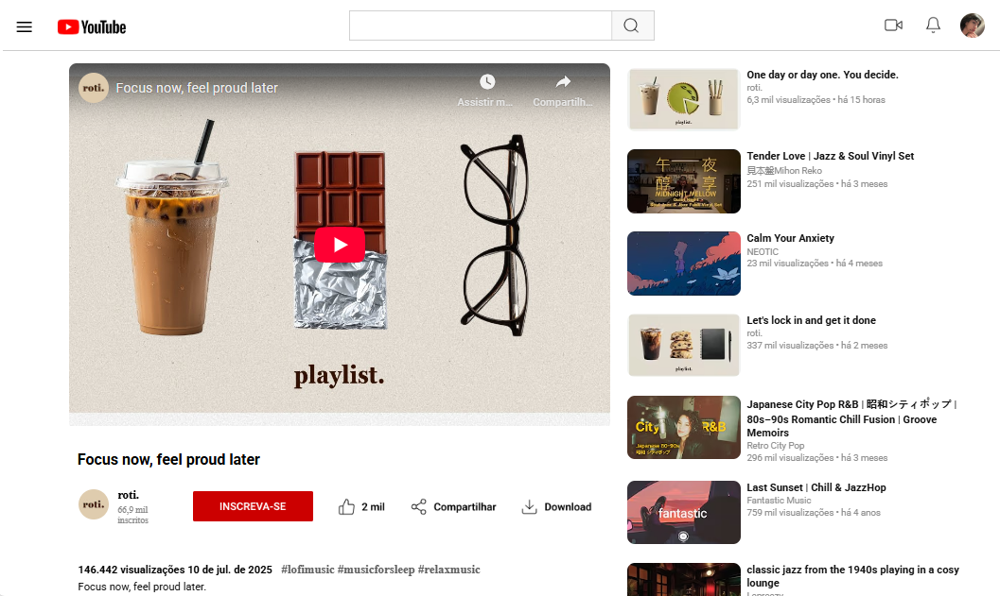

# Trilha CSS - Desafio 02: YouTube Page

Reprodução de uma página do **YouTube** com foco em **CSS e Flexbox**, desenvolvida como parte do **Bootcamp Santander 2025 - Front End (DIO)**.  

O objetivo foi praticar **layout responsivo**, **alinhamento de elementos** e organização de conteúdo com **Flexbox**.

---

## Preview do Projeto


👉 **Deploy Online:** [Acesse aqui](https://trilha-css-desafio-02-youtube-page.vercel.app/)

---

## O que foi desenvolvido
- Página com a reprodução de um vídeo no estilo YouTube.  
- Uso de **Flexbox** para estruturar o layout.  
- Conteúdo lateral com **playlists relacionadas**.  
- Personalização com vídeo favorito:  
  > *"Focus now, feel proud later"*, uma playlist relaxante que uso como plano de fundo no meu dia-a-dia. 🎧

---

## Tecnologias Utilizadas
- HTML5  
- CSS3 (com foco em **Flexbox**)  

---

## Estrutura do Repositório
- `index.html` → Estrutura principal da página  
- `assets/css/style.css` → Estilização com CSS  
- `assets/images/` → Imagens e ícones do projeto  

---

## Como Executar Localmente
1. Clone este repositório:
   ```bash
   git clone https://github.com/stephanie-lops/trilha-css-desafio-02-youtube-page.git

2. Acesse a pasta do projeto:
   ```bash
   cd trilha-css-desafio-02-youtube-page

3. Abra o arquivo index.html no navegador de sua preferência

## Créditos

Projeto desenvolvido no Bootcamp Santander 2025 - Front End (DIO)
Autora: Stephanie Lopes
